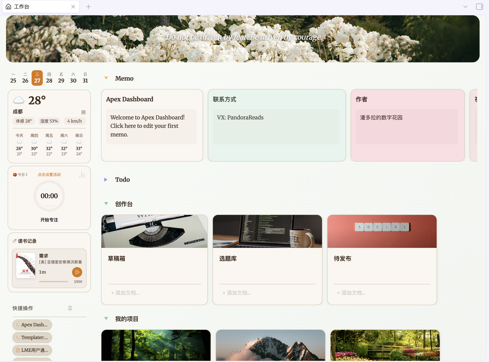
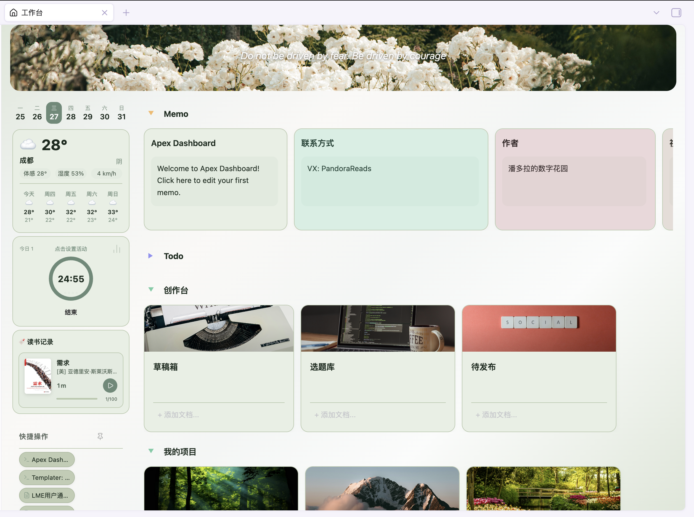
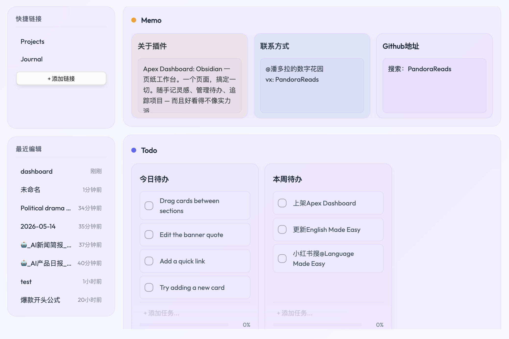

# Apex Dashboard

> Obsidian 一页纸工作台。一个页面，搞定一切。随手记灵感、管理待办、追踪项目 — 而且好看得不像实力派。

## 截图预览



## 功能特色

### 🗒️ Memo（备忘）
内置便签式 Memo 卡片，每张卡片都有可编辑文本区域，随时记录灵感、会议笔记或每日反思，无需离开仪表盘。支持 `[[双链]]` 渲染为可点击链接，轻松关联笔记。

### ✅ Todo（待办）
交互式任务清单，支持添加、拖拽排序、勾选完成。底部进度条以百分比实时显示完成进度。待办项同样支持 `[[双链]]`，方便交叉引用。

### 📁 Projects（项目）
将 Vault 文档组织为项目卡片。每张卡片可关联多篇笔记，支持封面图片（支持本地 Vault 图片和网络图片链接）和内联文档搜索，快速添加文件。支持管理多种文件类型，包括 Markdown 笔记、PDF、图片、音频和视频。

### 📝 Notes（笔记）
紧凑的列表式分区，用于整理参考文档和快捷访问文件。每行最多显示 5 张卡片，无封面图片，最大化信息密度。

### ⚡ 快捷操作
将常用快捷方式固定到侧边栏，支持两种操作类型：**文件**链接可打开任意文档，**命令**快捷方式可触发任意 Obsidian 命令。内置新建日记和新建笔记预设。

### 🌤️ 侧边栏小组件
左侧边栏提供多种信息小组件，方便快速查看和记录：

- **星期日历** — 紧凑的 7 天日历条，高亮当天日期
- **天气小组件** — 当前温度、体感温度、湿度、风速和 5 天天气预报，基于 Open-Meteo，无需 API Key
- **热力图小组件** — 将每日 frontmatter 数据（心情、睡眠、体重等）显示为 GitHub 风格热力图
- **番茄钟** — 带活动分类和统计的专注计时器
- **阅读追踪** — 添加书籍、记录阅读时长和页码进度
- **倒计时** — 自定义目标日期，显示剩余天数或小时数

### 🎨 Banner（横幅）
可自定义的横幅区域，支持编辑引言和背景图片（支持本地 Vault 图片和网络图片链接）。双击即可修改。

### 🔄 拖拽排列
在分区之间拖拽卡片来重新组织工作空间，也可以在 Todo 卡片内拖拽任务项进行排序，还支持在 Projects/Notes 卡片之间拖拽文档链接。

### 🧩 自定义分区
创建分区时可选择多种内置类型 — **Memo**、**Todo**、**Projects**、**Notes**、**Library**、**Dashboard** — 每种类型都有独立的布局和行为。自由组合，打造专属工作流。

### 📊 Dashboard 小组件
Dashboard 分区可以承载更偏“仪表盘”的组件，并以响应式网格布局展示：

- **Weather** — 在主仪表盘区域显示天气和预报卡片
- **Tracker** — 基于 frontmatter 日常数据的图表卡片
- **Tasks Query** — 通过 Obsidian Tasks 插件原生渲染 `tasks` 代码块，兼容 Tasks 查询语法和显示效果
- **Dataview** — 通过 Dataview 插件原生渲染 `dataview` 代码块，支持表格、列表等查询结果
- **Excalidraw** — 关联并嵌入 Excalidraw 绘图，使用 Obsidian Markdown 原生嵌入渲染

Dashboard 小组件支持调整大小、拖拽排序、分区折叠，并针对 Tasks/Dataview/Excalidraw 这类较重的原生渲染组件优化了拖拽性能。

### 🕐 最近文档
侧边栏展示最近编辑的文件及相对时间，快速回到最近的工作。

## 主题





14 款精心设计的主题，各具风格：

| 主题 | 风格 |
|------|------|
| **大地** | 温暖有机的质感，羊皮纸色调 |
| **北欧** | 简约清爽，蓝色点缀 |
| **极光** | 冰霜玻璃质感，极光渐变动画 |
| **岛屿** | 动物森友会风格柔和色调，森林绿配海洋蓝 |
| **苔原** | 冷灰底 + 牛油果绿极光，鼠尾草绿玻璃卡片 |
| **花漾** | 玫瑰色柔光，透明分区无边框 |
| **薄雾** | 烟雾白蓝渐变，极致透明玻璃质感 |
| **余烬** | 暖烟篝火渐变，琥珀色光晕 |
| **翡翠** | 翠绿竹雾，翡翠利落切边 |
| **抹茶** | 莫兰迪绿，温暖实色 |
| **丁香** | 莫兰迪紫，柔和低饱和 |
| **日食** | 工业感单色，利落线条 |
| **曜黑** | 纯黑底配柠檬高亮，亮暗模式一致 |
| **墨白** | 纯黑白极简，无玻璃质感与渐变 |

所有主题均支持 Obsidian 亮色和暗色模式。

## 设置选项

- **Dashboard 文件路径** — 自定义仪表盘数据文件的存放路径
- **样式** — 从 14 款视觉主题中选择
- **语言** — 支持英文和中文界面
- **最近文档数量** — 控制侧边栏显示的最近文件数量
- **侧边栏小组件** — 可分别启用和配置天气、热力图、番茄钟、阅读、倒计时等小组件
- **阅读设置** — 开关阅读追踪器和阅读完成提示音

## 安装

### 从 Obsidian 社区插件市场安装
1. 打开 设置 > 第三方插件
2. 浏览并搜索 "Apex Dashboard"
3. 点击安装，然后启用

### 手动安装
1. 从 [GitHub Releases](https://github.com/pandorareads/apex-dashboard/releases) 下载最新版本
2. 解压到 Vault 的 `.obsidian/plugins/apex-dashboard/` 目录
3. 打开 设置 > 第三方插件，启用 "Apex Dashboard"

## 开发说明

### 环境要求

- Node.js 18+
- npm
- Obsidian 桌面端
- 一个用于测试的本地 Obsidian 仓库

安装依赖：

```powershell
npm install
```

### 修改源码

主要代码位于 `src/`：

- `src/main.ts` — 插件入口、命令注册、设置加载
- `src/view.ts` — Dashboard 视图生命周期和整体渲染流程
- `src/renderer.ts` — 分区/卡片渲染、Dashboard 小组件、原生 Markdown 集成
- `src/dnd.ts` — 卡片拖拽逻辑
- `src/parser.ts` / `src/sync.ts` — `dashboard.md` 的解析和持久化
- `styles.css` — 插件界面样式
- `manifest.json` / `package.json` — 插件元数据和版本号

修改 TypeScript 或 CSS 后，应先构建，再复制到 Obsidian 插件目录测试。

### 编译

```powershell
npm run build
```

该命令会执行 TypeScript 类型检查，并用 esbuild 打包插件。构建后的运行文件包括：

- `main.js`
- `manifest.json`
- `styles.css`

### 手动打包

手动发布时，只需要打包以下三个文件：

```text
main.js
manifest.json
styles.css
```

用户将压缩包解压到以下目录即可：

```text
<vault>/.obsidian/plugins/apex-dashboard/
```

### 更新到本地 Obsidian 仓库

PowerShell 示例：

```powershell
$Vault = "D:\自用仓库"
npm run build
Copy-Item -LiteralPath main.js,manifest.json,styles.css -Destination "$Vault\.obsidian\plugins\apex-dashboard" -Force
```

然后重载插件：

```powershell
obsidian plugin:reload id=apex-dashboard
```

如果 Obsidian 仍然使用旧的插件代码，请完整退出并重新打开 Obsidian。旧版 Obsidian installer 可能无法通过 CLI reload 稳定刷新插件 JavaScript 和 CSS。

### 版本更新检查清单

准备新版本时：

1. 更新 `package.json`。
2. 更新 `manifest.json`。
3. 更新 `versions.json`，加入新版本和最低 Obsidian 版本。
4. 运行 `npm run build`。
5. 将 `main.js`、`manifest.json`、`styles.css` 复制到测试仓库。
6. 重载或重启 Obsidian，并验证 Dashboard。
7. 提交源码和生成的发布文件。

## 使用方法

1. 通过左侧功能区图标（主页图标）或命令面板打开：`Apex Dashboard: Open dashboard`
2. 首次使用会在 Vault 根目录自动创建 `dashboard.md` 文件
3. 所有更改直接保存到文件 — 纯文本格式，你的数据完全属于你

> **注意：** 删除、重命名或对分区进行排序，需要在 `dashboard.md` 笔记中进行操作。在笔记中的任何修改，会在工作台界面中直接生效。

## 更新日志

### 1.1.6
- **Dashboard 集成小组件** — 为主 Dashboard 分区新增 Tasks Query、Dataview、Excalidraw 卡片
- **原生 Markdown 渲染** — Tasks、Dataview、Excalidraw 卡片通过 Obsidian Markdown 处理器渲染，使第三方插件输出更接近原生行为
- **响应式 Dashboard 布局** — Dashboard 卡片改为响应式网格，移除旧的窄宽度限制，并改进重内容卡片的宽高处理
- **分区折叠修复** — Dashboard 分区在启用网格布局时也能正确折叠
- **集成卡片尺寸优化** — Tasks、Dataview、Excalidraw 使用更高的默认尺寸，并在内部处理滚动，改善较长内容的查看体验
- **Excalidraw 关联流程** — 新建 Excalidraw 绘图后可自动关联到 Dashboard 卡片，并以原生嵌入方式显示
- **拖拽性能优化** — 卡片排序时缓存落点布局，使用 `requestAnimationFrame` 节流拖拽更新，复用落点指示器，并使用轻量拖拽预览，减少原生渲染组件带来的卡顿

### 1.1.5
- **链接悬停预览** — 按住 Ctrl/Cmd 并将鼠标悬停在文档链接或 `[[双链]]` 上，即可在不离开仪表盘的情况下查看原生页面预览浮窗。覆盖项目/笔记卡片的文档列表、备忘录与待办里的双链、以及数据库（library）分区
- **就地编辑笔记弹窗** — 单击链接即弹出居中窗口，内嵌完整的 Obsidian Markdown 编辑器（实时预览，并提供「阅读/源码」切换且记住上次选择），无需打开新标签页即可在仪表盘内直接阅读和编辑笔记；需要完整编辑时可点「在标签页打开」
- **数据库分区支持** — 库分区文件（网格、列表、表格、看板）现支持悬停预览与就地编辑弹窗，与项目分区体验一致
- **移动端保持不变** — 移动端链接仍维持原有的「打开标签页」行为

### 1.1.4
- **子任务折叠** — 含子任务的任务现可折叠其子项，折叠状态持久化保存，重开 Obsidian 后保持。仅含子项的父任务显示折叠箭头，叶子任务不再有左侧占位空白，列表更紧凑
- **项目卡片文档嵌套（子文档）与折叠** — 项目卡片的文档链接现支持像待办子任务一样拖拽嵌套：拖拽一个文档到另一个上即可嵌套为子文档（置前 / 置后 / 嵌套三种落点），含子文档的项可折叠。以缩进 Markdown 嵌套列表保存，链接在任何 Obsidian 视图下都保持有效（不会因缩进变代码块而失效）
- **嵌套任务（子任务）** — 任务现支持多层级嵌套，以缩进 Markdown 持久化保存。拖拽任务到另一任务上即可嵌套（支持置前 / 置后 / 嵌套三种落点），可重排顺序或跨卡片移动。移动端长按拖拽、横向滑动嵌套/取消嵌套。勾选父任务会联动勾选其所有子任务
- **新增两款主题：墨白与曜黑** — 新增 Mono（墨白，纯黑白极简，无玻璃/渐变，随系统明暗自适应）和 Onyx（曜黑，纯黑配柠檬黄强调色，明暗模式完全一致）。同时移除了春日（Prism）主题
- **热力图小组件增强** — 侧边栏热力图现可从可配置的日记文件夹解析每日日记，支持自定义显示标题，并提供两种范围模式：滚动（最近 N 天）或周期（当月/当季/当年）
- **侧边栏日历自动刷新** — 侧边栏星期日历现会在午夜后自动更新"今天"高亮和日期，即使工作台视图保持固定打开（此前会停留在首次打开那一天的日期）
- **快捷操作自定义命名** — 添加文件或命令类快捷操作时，可在确认步骤设置自定义显示名称（并选择图标），不再只能使用默认名称
- **修复手机端拖放文字残影** — 长按卡片拖动时，若触摸被系统中断（边缘手势、通知下拉、滚动抢占），不再在屏幕上留下永久的文字残影。新增 touchcancel 处理来清理拖拽幽灵元素，重渲染时清扫残留幽灵，并禁用幽灵与拖拽卡片的过渡动画以消除拖尾
- **备忘录另存为笔记** — 备忘录卡片新增"另存为笔记"按钮，可将内容保存为独立的笔记文件，保存路径可在设置中配置（memoSavePath）

### 1.1.3
- **移动端小组件栏重构** — 将覆盖在 Banner 上的标签按钮改为 Banner 下方的可折叠横条。点击横条展开书签标签（番茄钟、阅读、农历），再点击标签展开对应的小组件面板
- **主题自适应标签颜色** — 标签图标从灰色（未激活）过渡到主题主文字颜色（激活），同时适配亮色和暗色主题
- **更宽的标签按钮** — 标签按钮宽度增加，更易点击
- **更新小组件图标** — 番茄钟使用沙漏图标，农历使用月亮图标，视觉识别更清晰
- **自定义对话框** — 用 Obsidian 风格的自定义弹窗替代原生浏览器对话框
- **类名规范化** — 清理内部类命名约定
- **样式优化** — 多处视觉打磨和一致性修复

### 1.1.2
- **Obsidian 插件审核修复** — 回应官方 Obsidian 插件审核流程的反馈
- **MIT 许可证** — 许可证从 ISC 更改为 MIT

### v1.1.1
- **Library 配置持久化** — 修复关键 Bug：数据库分区的配置（筛选条件、视图模式、排序设置、每页数量）在重启 Obsidian 后丢失。YAML 解析器现在能正确处理列定义中的嵌套对象
- **网格位置持久化** — 修复网格定位值（gcol/grow）从未被保存到 dashboard 文件的问题，导致卡片位置在重载后重置
- **写入竞态修复** — 修复快速连续更新时文件监视器可能用旧数据覆盖新数据的竞态条件

### v1.0.7
- **任务提醒** — 为每个任务设置提醒时间。点击任务旁的铃铛图标，通过日历弹窗选择日期和时间
- **日历选择器** — 可视化月历弹窗，支持翻月、点选日期、小时和分钟下拉选择（无需手动输入日期）
- **过期提醒** — 过期任务的铃铛图标变红并带脉冲动画
- **Obsidian 通知** — 60 秒定时检查，任务到期时弹出 Obsidian Notice 通知
- **Markdown 内联存储** — 提醒以 `⏰ YYYY-MM-DD HH:MM` 格式存储在任务文本中，可在 Markdown 文件中直接查看和编辑
- **岛屿主题** — 全新动物森友会风格柔和色调主题，森林绿分区配海洋蓝点缀
- **国际化** — 提醒 UI 支持中英文
- **分区卡片拖拽伸缩** — 所有分区卡片支持拖拽调整宽度，带最小/最大宽度约束，尺寸自动持久化
- **可伸缩侧边栏** — 左侧边栏可自由伸缩调整宽度，点击图钉按钮可固定侧边栏
- **6 款新主题** — 苔原（鼠尾草绿极光）、花漾（玫瑰柔光透明分区）、薄雾（烟雾蓝雾玻璃质感）、余烬（暖烟篝火渐变）、暮霞（紫色暮光薄雾）、翡翠（翠绿竹雾）
- **透明分区** — 苔原、花漾、薄雾、余烬、暮霞、翡翠均采用无边框透明分区，卡片悬浮显示
- **Banner 遮罩移除** — Banner 图片不再被半透明滤镜覆盖
- **加速轮播** — 名言每小时轮换，图片每 30 分钟轮换

### v1.0.6
- **多名言轮播** — Banner 支持存储多条名人名言，可在编辑弹窗中添加、编辑和删除
- **背景图轮播** — 支持添加多张背景图片，每 2 小时自动切换，带淡入淡出过渡效果
- **名言自动轮播** — 名言每 2 小时自动切换（与背景图错开 1 小时，不会同时切换）
- **双击重命名分区** — 双击任意分区标题即可内联编辑名称（Enter 保存，Escape 取消）
- **分区折叠** — 点击分区标题左侧的倒三角可折叠/展开分区，折叠状态跨会话保留
- **跨卡片拖拽** — 支持在 Projects/Notes 卡片之间拖拽文档链接，在 Todo 卡片之间拖拽任务项
- **卡片排序修复** — 修复所有分区（待办、项目、笔记）的卡片拖放定位问题，卡片现在会精确放置到拖放位置
- **空卡片交互** — 清空所有项目后的卡片仍可通过拖拽或输入框添加新内容

### v1.0.5
- **移动端优化** — 隐藏备忘录调色板按钮、抽屉使用实色背景适配所有主题、快捷操作列表加高显示
- **分区类型颜色** — 四种分区类型（备忘、待办、项目、笔记）各有独立的倒三角颜色
- **横幅弹窗按钮尺寸** — 编辑横幅弹窗中的「添加名言」和「添加图片」按钮改为自适应宽度，不再撑满整行
- **项目卡片默认宽度** — 修复新建项目卡片拉伸占满整个分区的问题，卡片现在使用 280px 默认宽度
- **分区类型加固** — 三层防御体系确保分区类型不丢失：frontmatter type 字段、名称推断、卡片类型分布分析。支持手动编辑文件、重命名标题、调换位置等场景
- **项目卡片类型持久化** — `type: project` 现在会写入文件并在保存/重载后保留，防止卡片类型回退为 generic
- **默认模板修复** — Projects 和 Library 分区在默认模板和列定义中现在包含 sectionType

### v1.0.4
- **快捷操作** — 快捷链接升级为快捷操作，支持文件链接和 Obsidian 命令快捷方式
- **添加操作弹窗** — 双标签页（文件/命令）添加自定义操作，内置新建日记和新建笔记预设
- **4 种分区类型** — Memo、Todo、Projects、Notes，每种类型拥有独立布局和行为
- **多格式文档支持** — 在项目卡片中管理 Markdown、PDF、图片（PNG、JPG、GIF、SVG、WebP）、音频（MP3、M4A）和视频（MP4、MOV）
- **双向链接** — Memo 和 Todo 卡片将 `[[双链]]` 渲染为可点击链接，支持 basename 回退
- **日记路径设置** — 配置新建日记的保存路径
- **UI 优化** — 桌面端隐藏垂直滚动条、主题色水平滚动条、Notes 分区布局优化
- **Bug 修复** — 修复备忘录卡片双链点击、快捷链接重命名竞态条件、插件卸载时重命名监听器清理

### v1.0.3
- **双链支持** — Memo 和 Todo 卡片现在会将 `[[双链]]` 渲染为可点击链接
- **分区类型选择** — 创建新分区时可选择分区类型
- **移动端侧边栏抽屉** — 移动端导航采用滑入动画
- **分区创建体验优化** — 移动端分区创建增加确认按钮，新增"添加新分区"命令快捷方式
- **Bug 修复** — 卡片拖拽限制在标题/封面区域，修复移动端横幅编辑按钮和抽屉对齐问题

### v1.0.2
- **分区管理** — 支持手动删除分区、分区类型选择器
- **移动端优化** — 改善卡片滚动和移动端布局
- **Bug 修复** — 遵循正文分区顺序，防止表单意外重置

## 兼容性

- Obsidian v0.15.0+
- 桌面端和移动端
- 所有主题均适配亮色和暗色模式

## 许可证

0BSD
